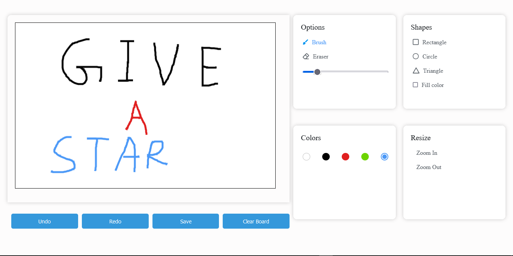

# SketchBook

SketchBook is a simple and interactive web-based drawing application developed using HTML, CSS, and JavaScript. The application allows users to sketch freely on a blank canvas, with customizable color, brush size, and eraser tools, making it perfect for casual doodling or creating quick sketches.

---

## Table of Contents

- [Features](#features)
- [Screenshots](#screenshots)
- [Tech Stack](#tech-stack)
- [Installation](#installation)
- [Usage](#usage)
- [Contributing](#contributing)

---

## Features

- **Drawing Tools**: Choose from a variety of brush sizes and colors for different drawing styles.
- **Eraser Tool**: Easily erase parts of your sketch with a dedicated eraser tool.
- **Clear Canvas**: Start over anytime by clearing the canvas with a single click.
- **Download Sketch**: Save your artwork as an image file to your device.
- **Responsive Design**: Works seamlessly across desktops, tablets, and mobile devices.

---

## Screenshots

### Main Page



---

## Tech Stack

- **Frontend**: HTML5, CSS3, JavaScript (Canvas API)
- **Libraries**: None (Vanilla JavaScript)

---

## Installation

### Prerequisites

- A modern web browser (Chrome, Firefox, Safari, etc.)

### Steps

1. **Clone the Repository**

   ```bash
   git clone https://github.com/bijuaryal91/SketchBook.git
   cd SketchBook
   ```

2. **Open the application**
   Open the `index.html` file in your preferred web browser to start using SketchBook.

---

## Usage

1. **Select Brush Color**: Choose a color from the color palette to begin drawing.
2. **Adjust Brush Size**: Use the brush size options to select a thicker or thinner brush.
3. **Draw on Canvas**: Click and drag on the canvas area to start sketching.
4. **Eraser Tool**: Switch to the eraser tool to remove parts of your sketch.
5. **Clear Canvas**: Click the "Clear" button to reset the canvas.
6. **Download**: Save your drawing as an image by clicking the "Download" button.

## Contributing

- Fork the repository
- Create a new branch (git checkout -b feature-name)
- Commit your changes (git commit -m "Add new feature")
- Push to the branch (git push origin feature-name)
- Open a Pull Request
